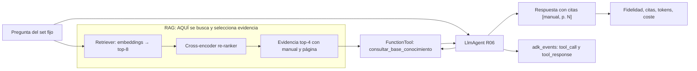

# Sesión 5 · RAG sobre manuales de lavadora

Este proyecto explica Retrieval-Augmented Generation sobre cuatro manuales reales de lavadora. El mismo corpus se usa en dos notebooks y en un chatbot construido con Google ADK.

## Qué contiene

```text
rag/
├── data/raw/                 # Los 4 PDFs originales, versionados
├── notebooks/
│   ├── 01_rag_desde_cero.ipynb
│   ├── 02_rag_con_chromadb.ipynb
│   ├── 03_comparacion_herramientas_rag.ipynb
│   └── 04_evaluacion_extractores_pdf.ipynb
├── src/laundry_rag/          # Ingesta, chunking, embeddings y retrieval compartidos
├── chatbot/                  # Aplicación ADK + interfaz Streamlit
├── experiments/              # Matriz R01--R08 y set fijo de evaluación
└── scripts/build_index.py    # Reconstrucción explícita del corpus y ChromaDB
```

Los archivos derivados (`data/processed/` y `data/chroma/`) no se versionan: se construyen localmente desde los PDFs incluidos.

## Instalación

Se necesita Python 3.12, [uv](https://docs.astral.sh/uv/) y Tesseract. En macOS:

```bash
brew install tesseract tesseract-lang
cd rag
uv python install 3.12
uv sync --extra dev
cp .env.example .env
```

Configura `GOOGLE_API_KEY` en `.env`. Gemini se usa sólo para redactar la respuesta: los embeddings se calculan localmente con `sentence-transformers`. La primera ejecución descarga el modelo de embeddings. `torchvision` se incluye para que Streamlit pueda inspeccionar sin errores los módulos opcionales de `transformers` usados por ese modelo.

## Recorrido de clase

1. Abre `notebooks/01_rag_desde_cero.ipynb`: inspecciona la extracción, construye chunks y calcula coseno con NumPy antes de llamar a Gemini.
2. Abre `notebooks/02_rag_con_chromadb.ipynb`: repite el retrieval usando ChromaDB y observa su ruta persistente, colección, documentos, metadatos, embeddings y distancias.
3. Abre `notebooks/03_comparacion_herramientas_rag.ipynb`: compara herramientas actuales para frameworks, chunking y bases vectoriales con criterios y documentación oficial.
4. Abre `notebooks/04_evaluacion_extractores_pdf.ipynb`: mide PyMuPDF, pypdf y pdfplumber sobre el corpus; evalúa manualmente estructura, orden de lectura y tablas, y deja Docling/Unstructured como extensiones opcionales.
5. Opcionalmente crea o reconstruye todo desde terminal:

```bash
uv run python scripts/build_index.py
```

El segundo PDF es escaneado y no contiene texto nativo; la ingesta activa OCR para sus páginas. Verifica visualmente el texto extraído antes de indexarlo: OCR puede introducir errores.

## Chatbot ADK

Primero crea el índice (con el segundo notebook o con el script) y luego ejecuta uno de estos puntos de entrada desde `rag/`:

```bash
uv run adk web chatbot/adk_apps --port 8000
uv run streamlit run chatbot/chat.py
```

La aplicación ADK se llama `manual_chatbot`. Su única herramienta visible es
`consultar_base_conocimiento(pregunta, top_k)`. Devuelve fragmentos con `manual`, `página`,
`sección`, texto y distancia. El agente debe consultarla antes de responder y citar cada hecho como
`[manual, p. N]`. Internamente delega en `ManualRetriever.consultar_manuales`, de modo que ADK,
Streamlit y el laboratorio experimental comparten el mismo contrato de evidencia.

### Ver la herramienta en ADK Web

Con el índice construido y `GOOGLE_API_KEY` configurada:

```bash
cd rag
uv run adk web chatbot/adk_apps --port 8000
```

Abre la aplicación **manual_chatbot**. En el inspector de la ejecución se verá la llamada a
`consultar_base_conocimiento`, sus argumentos y la evidencia devuelta. Prueba, por ejemplo:

> ¿Qué ciclo para ropa delicada aparece en el manual?

La respuesta debe llevar citas y la traza debe mostrar primero la herramienta. Si la pregunta no
está respaldada por los cuatro manuales, el contrato instruye al agente a contestar
`No encontré evidencia suficiente en los manuales.`

Al abrir Streamlit, entra también a **Laboratorio de chunking** en el menú lateral. Selecciona un PDF y una página; la primera pestaña muestra esa página renderizada y sus cortes reales con tamaño, overlap y técnica configurables, además de contrastar las cuatro técnicas. La segunda pestaña aplica la misma pregunta a las cuatro técnicas y ejecuta cuatro RAGs más un LLM-as-a-Judge para calificar relevancia, completitud y fundamentación sobre los chunks recuperados.

## Preguntas de demostración

- ¿Qué precauciones de seguridad debo revisar antes de usar la lavadora?
- ¿Cómo debo cuidar una lavadora si no la usaré durante vacaciones?
- ¿Qué debo verificar durante la instalación?
- ¿Qué ciclo debo elegir para ropa delicada? Indica el manual y la página.
- ¿Cuál es la receta para preparar pan de masa madre? *(debe reconocer que no hay evidencia)*

El contenido es educativo y documental; ante reparación, instalación o seguridad debe prevalecer el manual correspondiente al modelo del equipo y el servicio técnico autorizado.

## Calidad

```bash
uv run pytest -q
uv run ruff check .
```

## Laboratorio RAG por versiones

La matriz `R01`--`R08` conserva un set fijo de 15 preguntas y cambia una variable por salto:
chunking, embeddings, retrieval híbrido, re-ranking, contexto y finalmente la herramienta ADK.

```bash
# R01--R05 no llaman al LLM; R06--R08 usan Gemini y se repiten tres veces por defecto.
uv run python experiments/run.py --experiments R01 R03 R05 --no-mlflow
uv run python experiments/run.py --experiments R01 R02 R03 R04 R05 R06 R07 R08

# Explorar/ejecutar la matriz desde el menú de Streamlit.
uv run streamlit run chatbot/chat.py

# Consultar el histórico completo tras una corrida con MLflow.
uv run mlflow ui --backend-store-uri "sqlite:///$PWD/mlflow.db"
```

Cada corrida genera `data/experiments/<run-id>/results.json`, `results.csv` y `report.html`.
El HTML es autocontenido para compartirlo; MLflow conserva parámetros, métricas y esos artefactos.

### Cómo se integra R06 con ADK

R01--R05 sólo miden retrieval y no llaman a un modelo generativo. R06 activa el re-ranker y crea
un `LlmAgent` de ADK por caso. El runner entrega al agente la herramienta
`consultar_base_conocimiento`; ésta devuelve exclusivamente los fragmentos recuperados de esa
corrida. El runner conserva cada `tool_call` y `tool_response` en `adk_events`, además de la
respuesta, citas, tokens, latencia y métricas. R07 y R08 conservan el RAG con re-ranker pero
comparan `top_k=2` y `top_k=8` para medir coste y ruido de contexto.



> **El RAG se realiza antes de crear el agente ADK.** `retrieve_case(...)` recupera los chunks del
> índice vectorial, aplica el re-ranker R06 y produce `retrieval.evidence`. A partir de ese punto,
> ADK no consulta Chroma ni embeddings: la herramienta sólo entrega al modelo esos fragmentos ya
> seleccionados.

El código esencial de la nueva herramienta está en el runner. `evidence` no llega desde ADK:
primero el runner consulta el índice, reconstruye los objetos `Evidence` de los fragmentos
recuperados y los pasa como argumento a `_answer_with_adk`. La función interna conserva esa lista
mediante un *closure* y ADK la invoca cuando el modelo llama la herramienta.

```python
# ┌────────────────────── AQUÍ OCURRE EL RAG ──────────────────────┐
# Estas líneas existen dentro de run_experiment(...).
retrieval = retrieve_case(case, config, indexed_chunks, embeddings, model)
evidence = [Evidence(**item) for item in retrieval.evidence]
# └────────────────────────────────────────────────────────────────┘

# Desde aquí ADK recibe el resultado del RAG; no busca por su cuenta.
# R06 tiene generation=True y use_adk=True.
result.response, result.adk_events = asyncio.run(_answer_with_adk(case, evidence))


async def _answer_with_adk(
    case: EvaluationCase, evidence: list[Evidence]
) -> tuple[str, list[dict[str, object]]]:
    """R06: ADK decide usar una FunctionTool y deja una traza portable de eventos."""
    import os

    from google.adk.agents import LlmAgent
    from google.adk.runners import Runner
    from google.adk.sessions import InMemorySessionService
    from google.adk.tools import FunctionTool
    from google.genai import types

    def consultar_base_conocimiento(pregunta: str) -> dict[str, object]:
        """Busca en los manuales y devuelve evidencia citable para contestar la pregunta."""
        return {"pregunta": pregunta, "evidencia": [item.to_dict() for item in evidence]}

    agent = LlmAgent(
        name="rag_experiment_r06",
        model=os.getenv("RAG_MODEL", "gemini-2.5-flash"),
        instruction=(
            "Para responder usa siempre consultar_base_conocimiento. Responde sólo con su evidencia, "
            "cita [manual, p. N] y si no alcanza di exactamente: "
            "No encontré evidencia suficiente en los manuales."
        ),
        tools=[FunctionTool(consultar_base_conocimiento)],
    )
    sessions = InMemorySessionService()
    await sessions.create_session(app_name="rag_versions", user_id="runner", session_id=case.id)
    runner = Runner(agent=agent, app_name="rag_versions", session_service=sessions)
    events: list[dict[str, object]] = []
    answer = "No encontré evidencia suficiente en los manuales."
    async for event in runner.run_async(
        user_id="runner",
        session_id=case.id,
        new_message=types.Content(role="user", parts=[types.Part(text=case.question)]),
    ):
        parts = getattr(getattr(event, "content", None), "parts", []) or []
        for part in parts:
            call = getattr(part, "function_call", None)
            if call:
                events.append({"kind": "tool_call", "name": call.name, "arguments": dict(call.args or {})})
            response = getattr(part, "function_response", None)
            if response:
                events.append({"kind": "tool_response", "name": response.name})
            if getattr(part, "text", None) and event.is_final_response():
                answer = part.text
    return answer, events
```

Durante `runner.run_async(...)`, cada evento ADK se inspecciona: una llamada se guarda como
`{"kind": "tool_call", "name": "consultar_base_conocimiento", ...}` y su devolución como
`{"kind": "tool_response", ...}`. Así el reporte HTML y MLflow pueden demostrar que la respuesta
pasó por el RAG, no sólo mostrar el texto final.

La configuración es inmutable en `src/laundry_rag/experiments/catalog.py`, el set con fuentes
reales está en `experiments/evaluation_set.json`, y `experiments/run.py` escribe los artefactos y
los registra en MLflow. Esto permite comparar versiones sin cambiar el corpus, las preguntas ni
las demás variables entre saltos.

Las pruebas validan metadatos de extracción, chunks trazables, retrieval manual y el índice Chroma temporal. No requieren una clave Gemini ni descargan el modelo de embeddings.
