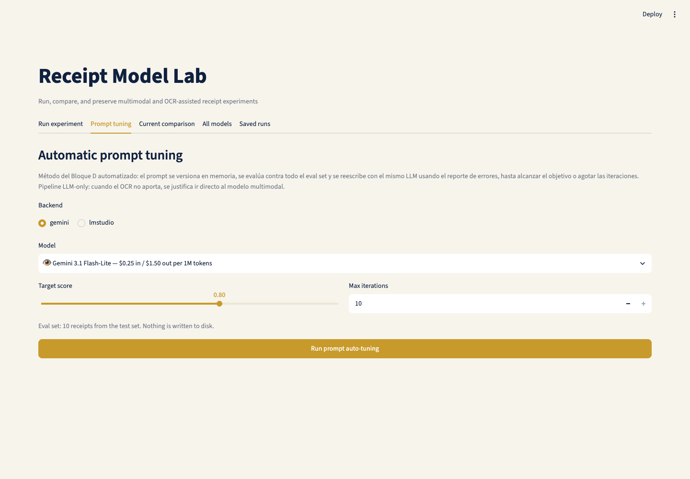
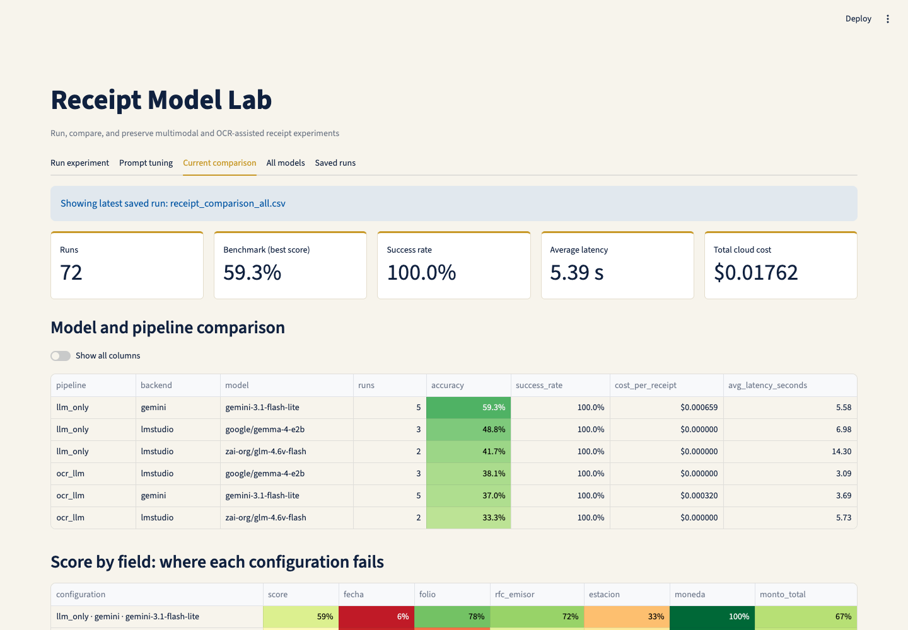
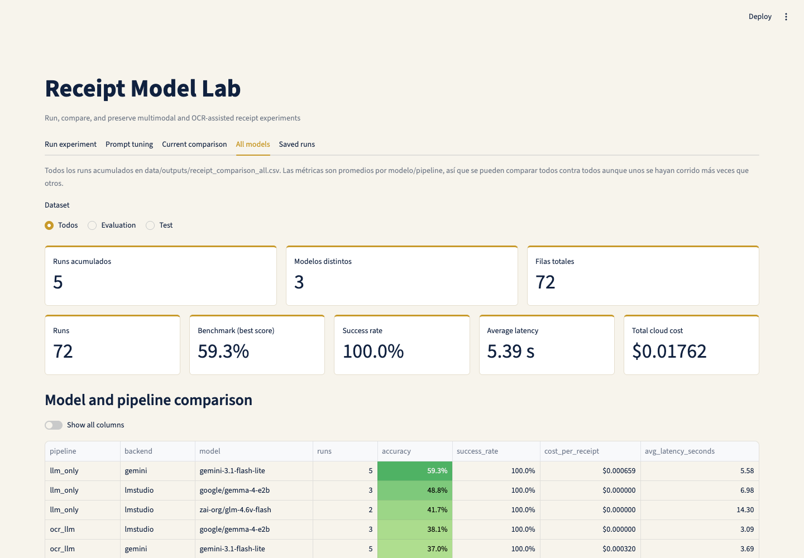
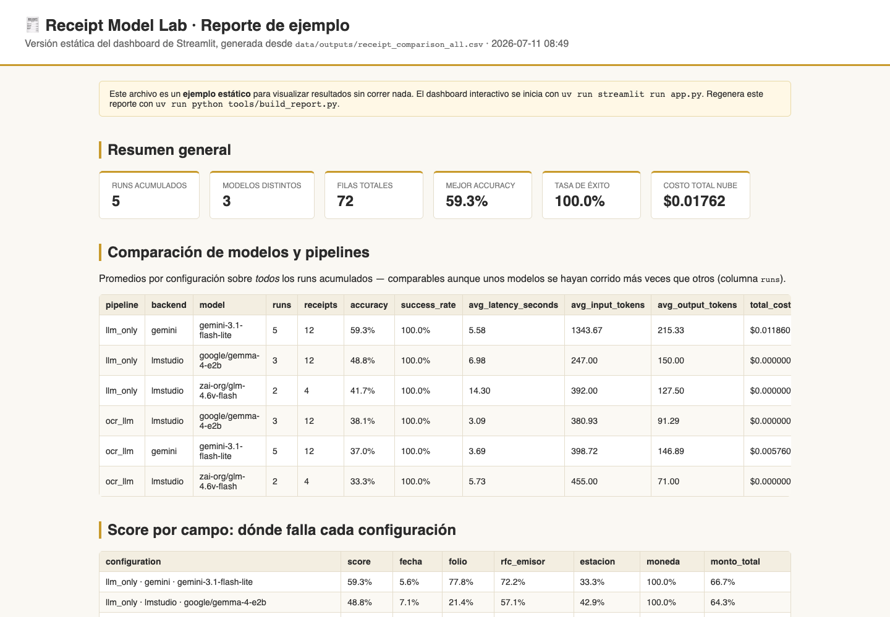

# Sesión 2: Arquitectura LLM, Prompting y Selección de Modelos

Proyecto de clase que conecta la presentación **Sesion_2-Arquitectura.pdf** con un caso práctico empresarial: extracción y validación de tickets de compra/gasolina usando modelos locales (LM Studio) y Gemini en la nube.

## Qué vas a construir

- Un flujo reproducible de validación de tickets.
- Un contrato JSON compartido para todos los modelos.
- Una tabla comparativa entre proveedores: calidad, latencia, tokens y costo estimado.
- Tres laboratorios progresivos, cada uno con edición para instructor y estudiante:
  - `01_model_calls_*`: llamadas REST de solo texto a LM Studio y Gemini; temperatura y límites de tokens.
  - `02_prompting_strategies_*`: zero-shot, one-shot, few-shot, razonamiento estructurado e integración de conocimiento.
  - `03_receipt_model_lab_*`: experimentos multimodales con tickets, evaluación, costos y decisión final. Incluye una demo inicial que compara cuatro variantes de prompt **sin esquema forzado** para ver cuánto importa el prompt por sí solo.
- Un dashboard en Streamlit para correr experimentos, afinar prompts y presentar resultados.

## Instalación del proyecto

```bash
cd session_2_architecture
uv python install 3.12
uv sync
cp .env.example .env
```

`uv` crea `.venv` con la versión de Python fijada en `.python-version` e instala las versiones exactas registradas en `uv.lock`.

## Kernel de notebooks en el IDE

No se requiere un servidor JupyterLab externo. Abre la carpeta del proyecto en el IDE, abre cualquier `.ipynb` y selecciona este intérprete/kernel:

```text
session_2_architecture/.venv/bin/python
```

En VS Code usa **Select Kernel → Python Environments → `.venv/bin/python`**. Si el IDE necesita descubrir el kernel explícitamente, ejecuta una vez desde la carpeta del proyecto:

```bash
uv run python -m ipykernel install --user \
  --name session-2-architecture \
  --display-name "Session 2 Architecture (Python 3.12)"
```

## Variables de entorno

Edita `.env` localmente:

```bash
GOOGLE_API_KEY=tu_llave_aqui
LMSTUDIO_BASE_URL=http://localhost:1234/v1
DEFAULT_GEMINI_MODEL=gemini-2.0-flash
DEFAULT_LMSTUDIO_MODEL=local-model
```

**Nunca subas `.env` al repositorio.** El `.gitignore` ya lo excluye; usa `.env.example` como plantilla.

## Límite de peticiones a la nube

Las llamadas a Gemini se limitan automáticamente en `src/receipt_validation/clients.py`:

- `gemini-3.1-flash-lite`: máximo **15 peticiones por minuto**.
- Cualquier otro modelo Gemini: máximo **5 peticiones por minuto**.

Si el proveedor responde HTTP 429, el cliente espera un minuto y reintenta una vez. Los modelos locales no tienen límite.

## Datos de tickets

1. Coloca las 10 imágenes de evaluación final en:

```text
data/images_eval/
```

2. Coloca las imágenes de experimentación/clase en:

```text
data/images_test/
```

3. Llena o verifica los valores esperados en:

```text
data/labels/expected_receipts.csv       # alias usado por los notebooks; apunta al set de evaluación
data/labels/expected_receipts_eval.csv  # etiquetas de la evaluación final
data/labels/expected_receipts_test.csv  # etiquetas de experimentación
```

Usa el nombre exacto del archivo de imagen en `file_name`. El notebook compara la salida del modelo contra este CSV.

> **Importante:** las imágenes de tickets y los CSV de etiquetas pueden contener datos fiscales reales (RFC, folios, montos). Por eso el `.gitignore` los excluye del repositorio; cada quien usa sus propios datos localmente.

## Flujo de la clase

Abre la carpeta del proyecto y el notebook de estudiante directamente en el IDE.

Flujo recomendado:

1. Completa `01_model_calls_student.ipynb` revelando las celdas correspondientes del instructor.
2. Continúa con `02_prompting_strategies_student.ipynb`; mantén el mismo ticket y compara prompts.
3. En el notebook 03, corre primero la demo de variantes de prompt (5 tickets, modo crudo sin esquema) para ver la diferencia entre un prompt genérico y uno estructurado.
4. Usa `images_test` mientras prompts y esquemas sigan cambiando.
5. Congela el experimento, cambia el notebook 03 a `DATASET = "eval"` y corre la comparación final una sola vez.
6. Exporta los resultados detallados y preséntalos en el dashboard.

Las celdas de solución del instructor usan las etiquetas `solution` y `hide-input`. Los renderizadores de notebooks compatibles pueden usar estas etiquetas para ocultar el código hasta el momento de revelarlo.

## Dashboard

```bash
uv run streamlit run app.py
```

El notebook 03 también contiene una celda final que inicia el dashboard con el kernel activo del IDE. Ejecútala y abre `http://localhost:8501`; no se necesita una terminal aparte.

El dashboard tiene cinco pestañas:

### 1. Run experiment

Corre modelos locales y/o de nube con ambos pipelines. El selector **"Modelos a evaluar"** permite elegir: ambos, solo Gemini o solo locales. El expander **"Prompt en uso (editable)"** muestra el prompt exacto que se envía al modelo y permite editarlo en vivo; si lo modificas, los resultados se marcan como `prompt_variant = "custom"`. Las llamadas a Gemini respetan automáticamente el límite de peticiones por minuto.


### 2. Prompt tuning

Automatiza el método del Bloque D: el prompt se versiona en memoria, se evalúa contra el set de prueba y se reescribe con el mismo LLM usando el reporte de errores, hasta alcanzar el objetivo o agotar las iteraciones. Cada versión muestra su score y puede cargarse en Run experiment con un clic.



### 3. Current comparison

Métricas agregadas del run actual (o del último guardado): tabla comparativa por modelo/pipeline, score por campo, gráficas de accuracy/latencia/tokens/costo y comparación ticket por ticket con la imagen del ticket, los valores esperados y el JSON extraído.



### 4. All models

El acumulado de **todos** los runs, guardado en `data/outputs/receipt_comparison_all.csv`. Compara todos los modelos contra todos con promedios por configuración — da igual que un modelo se haya corrido 5 veces y otro 1 (la columna `runs` lo indica). Incluye filtro por dataset y heatmap ticket por ticket.



### 5. Saved runs

Recarga cualquier CSV histórico sin volver a llamar a ningún modelo: mismas tablas y gráficas, más botón de descarga del CSV.


## Reporte HTML estático (ejemplo para alumnos)

Para ver un ejemplo de resultados **sin instalar ni correr nada**, abre en el navegador:

```text
docs/report/index.html
```

Es una réplica estática de la pestaña "All models": métricas, tablas comparativas, gráficas interactivas (Plotly) y heatmaps por ticket. Se versiona en git (el `.gitignore` no lo excluye) precisamente para que los alumnos lo tengan como referencia al clonar el repositorio. Solo contiene métricas agregadas y nombres de archivo — no incluye JSON extraído ni texto OCR, que pueden contener datos fiscales.



Para regenerarlo con los resultados acumulados actuales:

```bash
uv run python tools/build_report.py
```

## Línea base con OCR

El experimento final compara ambas estrategias de ejecución para cada modelo seleccionado:

- `llm_only`: envía la imagen del ticket directamente a un modelo multimodal.
- `ocr_llm`: extrae el texto localmente con Tesseract y envía ese texto al modelo.

Instala el ejecutable de Tesseract una vez en macOS:

```bash
brew install tesseract tesseract-lang
```

Para otra ubicación de instalación, define `TESSERACT_CMD` en `.env`.

Cada run guarda un CSV inmutable `data/outputs/receipt_comparison_<run_id>.csv` con latencia de OCR, latencia del modelo, latencia total, tokens, costo, exactitud por campo, errores de parseo, texto OCR y JSON extraído. Además, cada run se anexa al acumulado `receipt_comparison_all.csv`.

## Reglas de seguridad

- No guardes tickets reales en git.
- No escribas llaves de API en los notebooks.
- No pegues datos fiscales en herramientas públicas.
- Mantén las dependencias mínimas y fijadas mediante `pyproject.toml`.

Consulta `docs/security_notes.md` para las notas de enseñanza.
